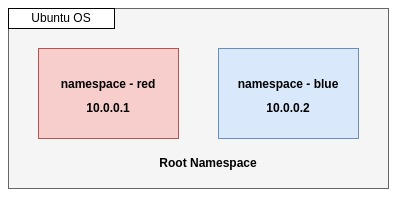
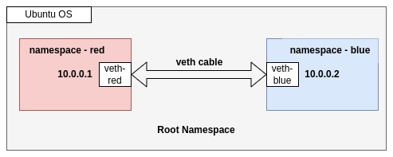
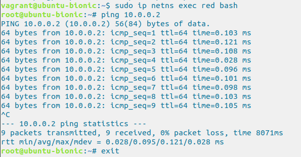
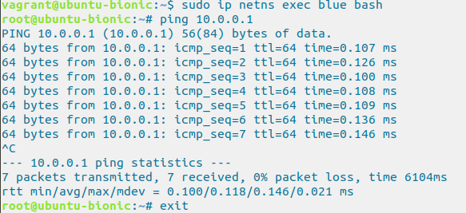

# Virtual Network Namespace connected by Virtual Ethernet (veth)

## Introduction:

Network namespaces provide a powerful way to isolate network resources within a Linux system. By creating and connecting namespaces, you can simulate separate network environments and control network connectivity between them. In this blog post, we will explore how to create multiple namespaces and connect them to each other using Virtual Ethernet (Veth) Cable at Vagrant.

## What is Network Namespace?

A network namespace is a logical copy of the network stack from the host system. Network namespaces are useful for setting up containers or virtual environments. Each namespace has its own IP addresses, network interfaces, routing tables etc.

One real-life example is where network namespaces are commonly used in containerization technology, such as Docker or Kubernetes. Containers provide lightweight, isolated environments for running applications, and network namespaces play a crucial role in enabling network isolation and connectivity for these containers.

<figure >

  
  
Network Namespace

</figure>

Now let’s try to create network namespaces and connect them by veth(virtual ethernet) cable.

## Prerequisites:

Basic familiarity with Linux and networking concepts.
VirtualBox & Vagrant are installed on your machine. Help Link — (https://github.com/titocbd/install-vagrant-vitualbox-at-ubuntu)
Creating Network Namespaces:

→ Login into Vagrant then open a terminal and execute/run the following commands to create two network namespaces.

sudo ip netns add red 
sudo ip netns add blue
→ Show the list of newly created Namespace:

sudo ip netns list

Output: 
blue 
red

→ Access to red Namespace:

sudo ip netns exec red bash

Then exit command to back root namespace.

## Creating Virtual Ethernet Cable:

→ Create a virtual Ethernet cable (Veth) that connects the namespaces:

sudo ip link add veth-red type veth peer name veth-blue

Show veth list:  sudo ip link list

→ Set veth(virtual ethernet) cable to each network namespace.

sudo ip link set veth-red netns red
sudo ip link set veth-blue netns blue

→ Configuring IP Addresses

Assign IP addresses to the veth(virtual ethernet) interfaces within the respective namespaces.

sudo ip netns exec red ip addr add 10.0.0.1/24 dev veth-red
sudo ip netns exec blue ip addr add 10.0.0.2/24 dev veth-blue

→ Enable veth interfaces/cables

Execute/run the following commands to bring up veth(virtual ethernet) interfaces/cables

sudo ip netns exec red ip link set dev veth-red up
sudo ip netns exec blue ip link set dev veth-blue up
OR
sudo ip -n red link set veth-red up
sudo ip -n blue link set veth-blue up

<figure >

  
  
Virtual ethernet between two NS

</figure>

## Testing connectivity:

To test the connectivity, let’s open two terminals, one for each namespace:

Terminal 1 (for red):

sudo ip netns exec red bash

Terminal 2 (for blue):

sudo ip netns exec blue bash

In Terminal 1 (red), you can now ping the IP address of veth-blue in blue namespace:

ping 10.0.0.2

If everything is set up correctly, you should see successful ICMP echo replies from red NS.

<figure >

  
  
icmp replies from terminal 1

</figure>

Same as from blue NS:

<figure >

  
  
icmp replies from terminal 2

</figure> 

So, you have created two namespaces, and successfully established communication between these originally isolated network namespaces via the Veth devices/pair created by you.

In this tutorial, we explore the concepts of network namespaces and virtual Ethernet (Veth) devices in Linux. We created isolated network environments and established communication between them and observe the traffic. These concepts are fundamental in network virtualization and isolation, providing a powerful toolset for various networking scenarios.
